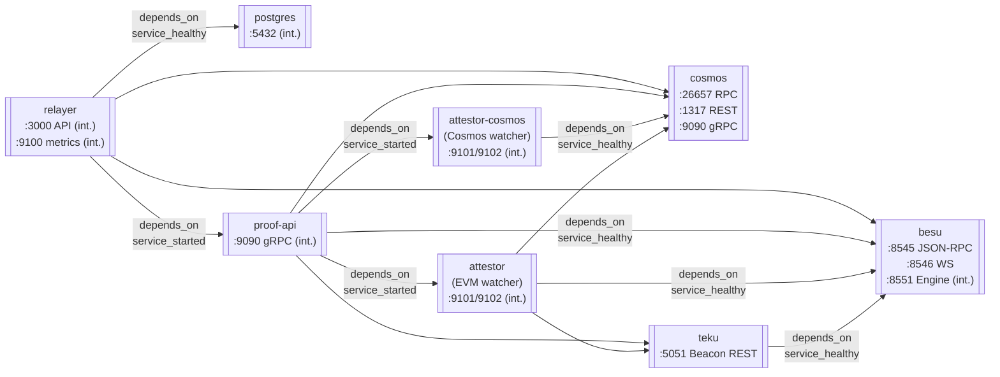
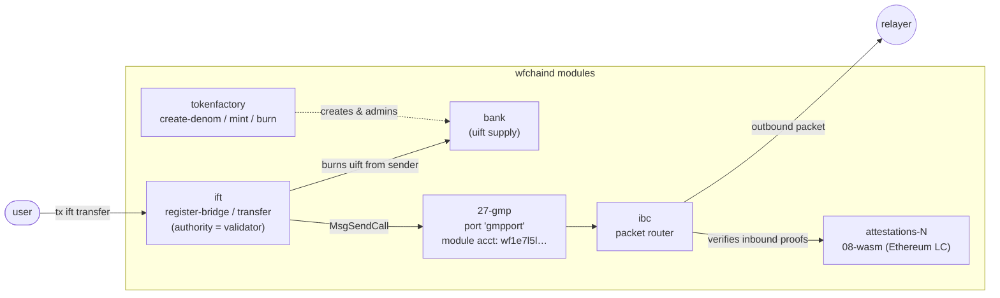
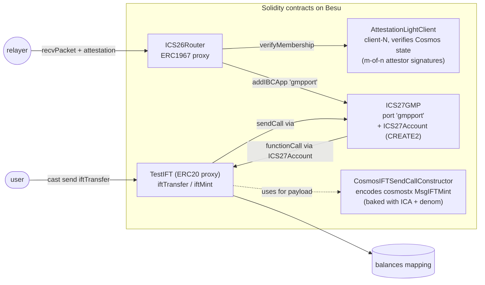

# Cosmos ↔ EVM IBC Demo

End-to-end demo of bidirectional IBC v2 token transfers between a Cosmos chain
(`wfchain`) and an Ethereum devnet (Hyperledger Besu + Teku). Transfers use
wfchain's **IFT** (Interchain Fungible Token) module — a tokenfactory-backed
mint/burn bridge that rides on top of **ICS27 GMP** (General Message Passing,
port `gmpport`), not standard ICS20. **Attestation-based light clients secure
both directions**: an `AttestationLightClient` on EVM verifies Cosmos state, and
an `08-wasm` attestation LC on Cosmos verifies EVM state. **Two attestor
processes** run side-by-side — one watching each chain (the binary takes a
singular `--chain-type` at startup) — sharing **one keystore** so they sign
under the same registered attestor address.

---

## Architecture

Split across three views: services/containers, Cosmos-side on-chain, EVM-side
on-chain. Skip to the one you need.

### 1. Services (Docker Compose)

The eight long-running containers, their host ports, and which services must be
healthy before each starts (`depends_on`). The two attestor services
(`attestor` for Besu, `attestor-cosmos` for Cosmos) each watch a single
chain — the binary takes a singular `--chain-type` at startup, so multi-chain
support requires multi-process. They share a keystore.



### 2. Cosmos-side modules

What's inside `wfchaind`, and how IFT packets route out. The attestation light
client tracks EVM state; the IFT module mints/burns a tokenfactory denom and
hands packets to GMP.



### 3. EVM-side contracts

On Besu, `ICS26Router` is the IBC hub; it routes `"gmpport"` to `ICS27GMP`
and verifies Cosmos inbound state via `AttestationLightClient`. `TestIFT` is the
ERC20 that mints/burns; `CosmosIFTSendCallConstructor` builds the `cosmostx`
payload for EVM→Cosmos.



---

## Components

| Service | Image | Ports | Role |
|---------|-------|-------|------|
| `cosmos` | `ghcr.io/cosmos/wfchain:latest` | 26657 RPC · 1317 REST · 9090 gRPC | Cosmos chain node |
| `besu` | `hyperledger/besu:26.2.0` | 8545 JSON-RPC · 8546 WS | Ethereum execution layer |
| `teku` | `consensys/teku:26.4` | 5051 Beacon REST | Ethereum consensus layer |
| `relayer` | `ghcr.io/cosmos/ibc-relayer:v0.0.2` | 3000 gRPC API · 9100 metrics | Bidirectional IBC packet relay |
| `attestor` | `ghcr.io/cosmos/ibc-attestor:latest` | 9101 HTTP (int.) | Watches Besu — signs EVM state attestations for the 08-wasm LC on Cosmos |
| `attestor-cosmos` | `ghcr.io/cosmos/ibc-attestor:latest` | 9101 HTTP (int.) | Watches Cosmos — signs Cosmos state attestations for `AttestationLightClient` on EVM |
| `proof-api` | `ghcr.io/cosmos/proof-api:latest` | 9090 gRPC (int.) | Aggregates attestor signatures into proofs the relayer fetches over gRPC |
| `postgres` | postgres | 5432 (int.) | Relayer packet state persistence |

---

## IBC Client Pair

```
Cosmos chain                        EVM (Besu)
────────────────────────────────    ─────────────────────────────────
attestations-N                      client-N
  type: 08-wasm (attestation LC)      type: AttestationLightClient
  verifies: EVM packet commitments    verifies: Cosmos packet commitments
  proof: attestor signatures          proof: attestor signatures
    (attestor watches besu)             (attestor-cosmos watches cosmos)
  merkle prefix: [""]                 counterparty: attestations-N
```

---

## Communication Flows

### Cosmos → EVM IFT Transfer

```
User
 │  wfchaind tx ift transfer uift attestations-0 <0xrecipient> <amount> <timeout>
 ▼
Cosmos IFT module
 ├─ burns <amount> uift from sender
 └─ asks GMP to send packet on port "gmpport" with "evm" constructor
        │
        ▼  Relayer polls cosmos:26657, picks up SendPacket
Proof API (cosmos_to_eth, attested mode)
 ├─ fetches Cosmos packet commitment           → cosmos:26657
 └─ queries attestor-cosmos for signature      → attestor-cosmos:9101
        │ Attestor reads Cosmos state          → cosmos:26657
        │ returns signed attestation
        ▼
Relayer submits MsgRecvPacket
 └─ eth_sendRawTransaction                    → besu:8545
       │ ICS26Router.recvPacket(packet, proof)
       ├─ AttestationLightClient.verifyMembership   (m-of-n signature check)
       └─ routes to "gmpport" → ICS27GMP.onRecvPacket
             ├─ _getOrCreateAccount(clientId, sender)  (CREATE2 proxy)
             └─ account.functionCall(TestIFT, payload)
                    └─ TestIFT.iftMint(receiver, amount)
                         ├─ checks bridge registered for clientId     ← registerIFTBridge
                         ├─ checks bridge.counterpartyIFTAddress == sender  ← IFT module addr
                         └─ _mint(receiver, amount) into ERC20 supply
```

### EVM → Cosmos IFT Transfer

```
User (or demo)
 │  cast send TestIFT "iftTransfer(string,string,uint256,uint64)" \
 │         client-0 <wf1…receiver> <amount> <timeout>
 ▼
TestIFT.iftTransfer
 ├─ burns <amount> from msg.sender
 └─ builds cosmostx payload via CosmosIFTSendCallConstructor
       └─ encodes MsgIFTMint{coin, receiver, signer: ICA}
              │
              ▼
ICS27GMP.sendCall(…, payload) on port "gmpport"
 │  ICS26Router emits SendPacket
 ▼
Relayer polls besu:8545, picks up SendPacket
Proof API (eth_to_cosmos)
 ├─ fetches EVM packet commitment       → besu:8545
 ├─ fetches beacon finality             → teku:5051
 └─ queries attestor for signature      → attestor:9101
        │ Attestor reads EVM state      → besu:8545
        │ returns signed attestation
        ▼
Relayer submits MsgRecvPacket
 └─ wfchaind tx                          → cosmos:26657
       │ attestations LC verifies signature
       └─ GMP/IFT module decodes payload + executes MsgIFTMint
             └─ tokenfactory mints <amount> uift to <wf1…receiver>
```

Two addresses worth calling out explicitly in the EVM→Cosmos direction (easy to
confuse — failing to separate them silently breaks minting):

- **ICA** (from `wfchaind query gmp get-address <client> <TestIFT> ""`): the
  signer of `MsgIFTMint` on Cosmos. Baked into `CosmosIFTSendCallConstructor`.
- **Cosmos IFT module account** (from `wfchaind query auth module-account ift`):
  the `.sender` in GMP packets FROM Cosmos. Stored as `counterpartyIFTAddress`
  in `TestIFT.registerIFTBridge` so `iftMint`'s auth check passes on the return
  leg.

---

## State Files

Runtime configs under `ibc/local/` and `cosmos/local/` are rendered from `.tmpl`
files at each run — don't edit them by hand.

| File | Rendered from | Contents |
|------|---------------|----------|
| `ibc/state.env` | (not rendered — built up via `state_set` appends from setup phases) | Persisted contract addresses and client IDs across runs |
| `ibc/local/config.yml` | `ibc/relayer-config.yml.tmpl` | Relayer chain config (endpoints, client ID mappings) |
| `ibc/local/relayer.json` | `ibc/proof-api.json.tmpl` | Proof API module config (attested mode in both directions, attestor endpoints) |
| `ibc/local/attestor-config.toml` | `ibc/attestor-config.toml.tmpl` | EVM-watching attestor — Besu RPC and `ICS26Router` address |
| `ibc/local/attestor-cosmos-config.toml` | `ibc/attestor-cosmos-config.toml.tmpl` | Cosmos-watching attestor — CometBFT RPC URL only (no router) |
| `ibc/local/keys.json` | `ibc/relayer-keys.json.tmpl` | Relayer signing keys (Cosmos mnemonic + EVM private key) |
| `cosmos/local/ibc_client_state.json` | `ibc/client-state.json.tmpl` | Attestation LC ClientState passed to `MsgCreateClient` (read by cosmos container at `/cosmos-config/local/`) |
| `cosmos/local/ibc_consensus_state.json` | `ibc/consensus-state.json.tmpl` | Attestation LC ConsensusState passed to `MsgCreateClient` |

The cosmos service has its **whole `/data/config/` directory bind-mounted from
`./cosmos/local/config/`** on the host (see `docker-compose.yml`). That means
`wfchaind init`, `add-genesis-account`, `gentx`, `collect-gentxs`, and the jq
patches all read+write the same files in place — no `docker cp` roundtrip. The
canonical `app.toml`/`config.toml` in `./cosmos/` are copied to
`./cosmos/local/config/` (host-side `cp`) right after init to override
init's defaults; everything else (`genesis.json`, `priv_validator_key.json`,
`node_key.json`, `client.toml`) is whatever wfchaind itself wrote.

The Cosmos genesis is patched in-place (not rendered) using two jq programs
running directly against the host file: `cosmos/patch-genesis.jq` (bond_denom
→ uatom, 08-wasm allowed client, **IFT module authority → validator address**
so `tx ift register-bridge` works with `--from validator` instead of requiring
a gov proposal) and `cosmos/inject-wasm-lc.jq` (embed the Ethereum LC wasm in
genesis).

`ibc/state.env` accumulates more keys than the template lists: phases after
Phase 4D append runtime-discovered addresses as they're resolved. Common
post-template additions:

| Key | Set by | Meaning |
|-----|--------|---------|
| `COSMOS_WASM_CLIENT_ID` | `create_ibc_clients` / `wait_for_ibc_ready` | `attestations-N` on Cosmos |
| `EVM_COSMOS_CLIENT_ID` | `create_evm_ibc_client` / `wait_for_evm_client` | `client-N` on EVM |
| `IFT_CONTRACT_ADDR` | `deploy_ift_contracts` | TestIFT proxy on EVM. ERC20 surface: `name() = "Test uift"`, `symbol() = "UIFT"` — aligned with the Cosmos `uift` denom so balances on both sides show matching names |
| `COSMOS_IFT_DENOM` | `register_ift_bridges` | `uift` (bare subdenom — wfchain's tokenfactory doesn't use `factory/…/…` in lookups). Same logical token as EVM `UIFT` — the bridge maps them 1:1 |
| `DEMO_TRANSFER_AMOUNT` | `register_ift_bridges` | rewritten to `<N>uift` so demos exercise IFT by default |
| `IFT_ICA_ADDRESS` | `register_evm_ift_bridge` | ICA bech32 — MsgIFTMint signer on Cosmos side, baked into CosmosIFTSendCallConstructor |
| `IFT_CTOR_ADDR` | `register_evm_ift_bridge` | Deployed `CosmosIFTSendCallConstructor` address |
| `COSMOS_IFT_MODULE_ADDR` | `register_evm_ift_bridge` | Cosmos IFT module account — stored as `counterpartyIFTAddress` in `TestIFT.registerIFTBridge` |

---

## Repo Layout

Static configs and templates are grouped by which service reads them — one
directory per chain/domain.

```
demo/cosmos-evm/
  setup.sh                  — CLI + config; sources lib/
  lib/
    common.sh               — logging, docker helpers, render_template, cast_in_net,
                              grpc_call, cosmos_tx_and_wait (poll-until-commit + raw_log on fail)
    chains.sh               — init_cosmos, init_ethereum, wait_for_services, print_status, clean
    ibc.sh                  — Phase 4: contract deploy, client create, IFT bridges,
                              register_evm_ift_bridge (ICA + CosmosIFTSendCallConstructor
                              deploy + TestIFT.registerIFTBridge), mint_ift_tokens
    demo.sh                 — user-story demonstrations (IFT transfers in both directions
                              via tx ift transfer / TestIFT.iftTransfer)

  cosmos/                   — Cosmos chain inputs
    app.toml, config.toml   — canonical wfchain / CometBFT config; cp'd to
                              cosmos/local/config/ after wfchaind init writes its defaults
    patch-genesis.jq        — jq transform: bond_denom + 08-wasm allowed client +
                              IFT module authority → validator address
    inject-wasm-lc.jq       — jq transform: embed Ethereum LC wasm in genesis
    local/                    — runtime cosmos files (gitignored)
      config/                   — bind-mounted to /data/config/ in the cosmos
                                  container; holds genesis.json, app.toml,
                                  config.toml, client.toml, node_key.json,
                                  priv_validator_key.json (init writes these,
                                  jq patches modify genesis in place)
      ibc_client_state.json     — rendered from ibc/client-state.json.tmpl
      ibc_consensus_state.json  — rendered from ibc/consensus-state.json.tmpl

  evm/                      — Besu + Teku inputs (mounted at /evm in both containers)
    besu.toml, teku.toml    — static EL + CL service config
    el-genesis.json         — static Besu execution-layer genesis
    cl-config.yaml          — static Teku minimal network config
    mnemonics.yaml.tmpl     — rendered into mnemonics.yaml during CL genesis generation
    jwt.hex, cl-genesis.ssz — generated at first run (gitignored)

  ibc/                      — IBC service inputs + runtime state
    relayer-config.yml.tmpl          — rendered to ibc/local/config.yml
    proof-api.json.tmpl              — rendered to ibc/local/relayer.json
    attestor-config.toml.tmpl        — rendered to ibc/local/attestor-config.toml         (EVM watcher)
    attestor-cosmos-config.toml.tmpl — rendered to ibc/local/attestor-cosmos-config.toml  (Cosmos watcher)
    relayer-keys.json.tmpl           — rendered to ibc/local/keys.json
    client-state.json.tmpl, consensus-state.json.tmpl — attestation LC create-client inputs
    state.env                 — persisted addresses + IDs, built up by state_set appends (gitignored)
    local/                    — rendered configs the services actually read (gitignored)
    solidity-ibc-eureka-<tag>/, ibc-relayer-<tag>/ — downloaded sources (gitignored)
    cw_ics08_wasm_eth.wasm    — extracted LC binary (gitignored)
```

Templates use bash `${VAR}` substitution; they're rendered via `render_template`
in `lib/common.sh`, which reads the file through an `eval cat <<EOF` heredoc —
no external `envsubst` or similar dependency.

---

## Prerequisites

### Host tools

All work happens inside Docker, so the host only needs the tools `setup.sh` shells out to directly:

| Tool | Used for |
|------|----------|
| `docker` + Compose v2 plugin | All service containers + one-off image runs |
| `jq` | JSON parsing (REST responses, forge broadcast artefacts, state files) |
| `curl` | HTTP polling for readiness + Cosmos REST / beacon REST queries |
| `openssl` | Random JWT secret, SHA-256 of the 08-wasm LC binary |
| `perl` | Logging — strips ANSI colour codes before writing to `logs/setup-*.log` |
| `bash` | Shell (script uses `[[ ]]`, `(( ))`, process substitution) |
| `base64`, `tar`, `gunzip`, `xxd`, `sed`, `awk`, `find` | Standard Unix utilities (bundled on macOS + Linux) |

> **Platform note.** The default `ETH2_TESTNET_GENESIS_IMAGE` tag is `master-linux-arm64` — override `ETH2_TESTNET_GENESIS_IMAGE` for x86_64 hosts.

### Resources

- **Disk:** ~5 GB free — most of it Docker images; solidity-ibc-eureka source + `bun install` node_modules adds ~500 MB under `ibc/`.
- **Memory:** 4 GB is enough for the full stack idle; demos are light.
- **Network:** first run pulls ~14 images and two GitHub tarballs; subsequent runs are fully offline if nothing's evicted.

### Host ports

`setup.sh` binds these to `localhost` via `docker-compose.yml` — they must be free:

| Port | Service | Protocol |
|------|---------|----------|
| 1317 | cosmos | REST API |
| 9090 | cosmos | gRPC |
| 26656 | cosmos | CometBFT P2P |
| 26657 | cosmos | CometBFT RPC |
| 5051 | teku   | Beacon REST |
| 8545 | besu   | JSON-RPC |
| 8546 | besu   | WebSocket |

Relayer (3000), relayer metrics (9100), attestor (9101), postgres (5432), and proof-api (9090-internal) are reachable only from inside the `ibc-net` Docker network.

### Docker images pulled on first run

All tags pin to `${VAR:-default}` in `setup.sh` — override any variable to use a different tag.

| Image | Variable | Purpose |
|-------|----------|---------|
| `ghcr.io/cosmos/wfchain:latest` | `COSMOS_IMAGE` | Cosmos chain node + CLI |
| `hyperledger/besu:26.2.0` | `BESU_IMAGE` | Ethereum execution layer |
| `consensys/teku:26.4` | `TEKU_IMAGE` | Ethereum consensus layer + validator client |
| `protolambda/eth2-val-tools` | `ETH2_VAL_TOOLS_IMAGE` | Generates BLS validator keystores |
| `ethpandaops/ethereum-genesis-generator:master-linux-arm64` | `ETH2_TESTNET_GENESIS_IMAGE` | Generates `cl-genesis.ssz` |
| `ghcr.io/foundry-rs/foundry:latest` | `FOUNDRY_IMAGE` | `forge script` deploy + `cast` calls |
| `oven/bun:1` | `BUN_IMAGE` | `bun install` for solidity-ibc-eureka deps |
| `ghcr.io/cosmos/ibc-relayer:v0.0.2` | `OPERATOR_IMAGE` | IBC packet relayer |
| `ghcr.io/cosmos/ibc-attestor:latest` | `ATTESTOR_IMAGE` | EVM state attestor |
| `ghcr.io/cosmos/proof-api:latest` | `PROOF_API_IMAGE` | Aggregates attestor signatures into proofs the relayer fetches over gRPC |
| `postgres:16` | (compose) | Relayer packet-state DB |
| `fullstorydev/grpcurl:latest` | (helper) | gRPC calls to relayer + proof-api |
| `migrate/migrate` | (helper) | Relayer DB migrations |
| `busybox` | (helper) | `cp` across Docker volumes (cosmos image has no shell) |

### Downloaded from GitHub on first run

Each fetch is skipped if the corresponding skip-and-reuse variable (below) is set or the target already exists on disk.

| Source | Default ref | Destination | Purpose |
|--------|-------------|-------------|---------|
| `cosmos/solidity-ibc-eureka` archive | `$SOLIDITY_IBC_TAG` (default `main` — the tagged `solidity-v2.0.1` predates `ICS27GMP.sol`, which is required for the IFT flow) | `ibc/solidity-ibc-eureka-<ref>/` | Forge deploy scripts, contract ABIs (`ICS26Router`, `ICS27GMP`, `TestIFT`, `CosmosIFTSendCallConstructor`), 08-wasm LC binary |
| `cosmos/ibc-relayer` archive | matches `OPERATOR_IMAGE` tag (`v0.0.2`) | `ibc/ibc-relayer-<tag>/` | SQL migration files for the relayer DB |
| `bun install` | (from solidity-ibc-eureka `package.json`) | `ibc/solidity-ibc-eureka-<ref>/node_modules/` | Forge deploy script JS deps |

### Skip-and-reuse knobs

Any of these, if pre-set, skips the corresponding step — useful for an existing deployment or a local checkout:

| Variable | Skips |
|----------|-------|
| `SOLIDITY_IBC_DIR` | GitHub tarball fetch — uses the provided checkout |
| `ETHEREUM_LC_WASM_PATH` | Wasm extraction from tarball |
| `WASM_CHECKSUM` | Wasm fetch + SHA-256 compute |
| `ICS26_ROUTER_ADDR` (AND router has bytecode on-chain) | Forge deploy — uses pre-deployed addresses. `EVM_ATTESTATION_LC_ADDR` is NOT part of this gate because it's deployed by `create_evm_ibc_client` via `cast --create`, not by `MinimalDeploy`. The on-chain bytecode probe re-deploys if Besu's volume was wiped but state.env survived. |
| `EVM_ATTESTATION_LC_ADDR` | `AttestationLightClient` deploy — uses an existing on-chain LC. Must be already registered with `ICS26Router.addClient`. |
| `COSMOS_WASM_CLIENT_ID` / `EVM_COSMOS_CLIENT_ID` | Client creation — uses existing clients (validated by `reconcile_ibc_client_pair`) |
| `IFT_MINT_AMOUNT` (tunable, default `1000000000`) | Amount minted into the sender JIT when the Cosmos→EVM demo needs IFT balance |
| `RELAYER_TX_FEE_AMOUNT` (tunable, default `20000`) | Flat fee (uatom) attached to every relayer-submitted tx on Cosmos — needs to clear `min-gas-prices × gas` |

Runtime state that survives between runs is persisted in `ibc/state.env`.

### Files and volumes written

- **Under `evm/`:** `jwt.hex`, `cl-genesis.ssz`, temporary `mnemonics.yaml` (removed after use)
- **Under `cosmos/`:** `local/config/{genesis.json,app.toml,config.toml,client.toml,node_key.json,priv_validator_key.json,…}`, `local/ibc_client_state.json`, `local/ibc_consensus_state.json` — bind-mounted directly into the cosmos container
- **Under `ibc/`:** `state.env`, `local/{config.yml,keys.json,relayer.json,attestor-config.toml,attestor-cosmos-config.toml,.ibc-attestor/}`, `cw_ics08_wasm_eth.wasm`, `solidity-ibc-eureka-<tag>/`, `ibc-relayer-<tag>/`
- **Under `logs/`:** `setup-YYYYMMDD-HHMMSS.log` (one per run)
- **Docker volumes** (prefixed with project dir name): `cosmos-data` (chain state + keyring; config now on host), `besu-data`, `teku-data`, `relayer-data`, `attestor-data`, `attestor-cosmos-data`, `postgres-data`

`./setup.sh clean` removes all of the above except the downloaded source tarballs in `ibc/` (those stay cached for fast re-runs).

---

## Usage

### Commands

```bash
# Full setup: init chains, deploy contracts, configure IBC, run demos
./setup.sh

# Init and start chains only (skip IBC)
./setup.sh chains

# Set up IBC on already-running chains
./setup.sh ibc

# Run demo scenarios
./setup.sh demo all          # all demos
./setup.sh demo cosmos-evm   # Cosmos → EVM transfer
./setup.sh demo evm-cosmos   # EVM → Cosmos transfer
./setup.sh demo track        # packet status tracking
./setup.sh demo failure      # timeout + retry flow
./setup.sh demo observe      # Prometheus metrics + logs

# Print current RPC endpoints and block heights
./setup.sh status

# Stop containers and wipe all data
./setup.sh clean
```

### Re-running after a partial setup

State is persisted in `ibc/state.env`. Individual phases are idempotent — re-running
`setup.sh ibc` skips already-completed steps (contract deploy, wasm store, client create)
by checking for non-empty values in `state.env`.

To force recreation of the IBC client pair (e.g. after a merkle prefix misconfiguration),
remove the relevant lines from `state.env` before re-running:

```bash
sed -i '' '/^COSMOS_WASM_CLIENT_ID=/d' ibc/state.env
sed -i '' '/^EVM_COSMOS_CLIENT_ID=/d'  ibc/state.env
./setup.sh ibc
```

---

## Setup Phases

| Phase | Function | Source | Description |
|-------|----------|--------|-------------|
| 1A | `init_cosmos` | `lib/chains.sh` | Cosmos init, validator + relayer keys, **genesis patch** (bond_denom → uatom, 08-wasm allowed client, IFT authority → validator), optional wasm LC inject, gentx + collect-gentxs |
| 1B | `init_ethereum` | `lib/chains.sh` | JWT secret, start Besu, generate Teku beacon-state SSZ with matching EL hash, BLS validator keystores into teku-data volume |
| 2 | `start_services` | `lib/chains.sh` | `docker compose up -d cosmos teku` (Besu already running) |
| 3 | `wait_for_services` | `lib/chains.sh` | Poll cosmos status + teku sync endpoint |
| 4A0 | `fetch_solidity_ibc` | `lib/ibc.sh` | Download `cosmos/solidity-ibc-eureka` archive at `$SOLIDITY_IBC_TAG` (default `main`) |
| 4A | `deploy_ibc_contracts` | `lib/ibc.sh` | `forge script MinimalDeploy` — deploys ICS26Router, **ICS27GMP**, **TestIFT**. Registers `ICS26Router.addIBCApp("gmpport", ICS27GMP)`. Skips on re-run if router already has bytecode. (`AttestationLightClient` is NOT deployed here — see Phase 4E3.) |
| 4A1 | `deploy_ift_contracts` | `lib/ibc.sh` | Parse `ift` label from forge return → `IFT_CONTRACT_ADDR` (TestIFT proxy) |
| 4B0 | `fetch_ethereum_lc_wasm` | `lib/ibc.sh` | Extract `cw_ics08_wasm_eth.wasm` from the downloaded source tarball |
| 4B | `store_ethereum_lc` | `lib/ibc.sh` | Compute SHA-256 of the LC wasm (it was already embedded in Cosmos genesis in Phase 1A) |
| 4C | `setup_relayer_key` | `lib/ibc.sh` | Resolve relayer bech32 address; copy Cosmos keyring into relayer-data volume |
| 4B5a | `reconcile_ibc_client_pair` | `lib/ibc.sh` | Verify persisted `COSMOS_WASM_CLIENT_ID` ↔ `EVM_COSMOS_CLIENT_ID` still match on-chain; clear both on inconsistency so the next phase recreates them |
| 4B5b | `create_ibc_clients` | `lib/ibc.sh` | Submit `MsgCreateClient` with attestation ClientState (rendered to `cosmos/local/ibc_*_state.json`); poll for commit via REST indexer |
| 4D | `generate_relayer_config` | `lib/ibc.sh` | Render `config.yml` + `keys.json` from templates (initial pass; finalized in 4F4 once both client IDs are known) |
| 4D1 | `generate_proof_api_config` + attestor configs | `lib/ibc.sh` | Render `relayer.json`, `attestor-config.toml`, `attestor-cosmos-config.toml` BEFORE start_relayer — relayer depends_on proof-api → attestor + attestor-cosmos, all of which bind-mount these host files; missing files would make compose either create a directory at the mount path or crash-loop the attestors |
| 4E0 | `_wait_for_postgres` + `run_db_migrations` | `lib/ibc.sh` | `docker compose up -d postgres`, poll `pg_isready`, then `migrate up` against the schema from `cosmos/ibc-relayer@<OPERATOR_IMAGE tag>` |
| 4E | `start_relayer` | `lib/ibc.sh` | `docker compose up -d relayer` (transitively starts proof-api + both attestors via depends_on) |
| 4E1 | `start_attestor` | `lib/ibc.sh` | Re-render attestor config, ensure keystore, `docker compose up -d attestor` (EVM watcher) |
| 4E1a | `start_attestor_cosmos` | `lib/ibc.sh` | Re-render config, `docker compose up -d attestor-cosmos` (Cosmos watcher, same keystore as EVM watcher) |
| 4E2 | `start_proof_api` | `lib/ibc.sh` | `docker compose up -d proof-api` (attested mode in both directions) |
| 4E3 | `create_evm_ibc_client` | `lib/ibc.sh` | Read attestor address from keystore + Cosmos head height/timestamp, deploy `AttestationLightClient(attestors, quorum=1, initHeight, initTs, roleManager=0x0)` via `cast --create`, register with `ICS26Router.addClient("client-N", …)` (merklePrefix MUST be `[0x]` length 1 — see code comment) |
| 4F | `wait_for_ibc_ready` | `lib/ibc.sh` | Poll Cosmos REST `/ibc/core/client/v1/client_states` for any `attestations-*` client |
| 4F1 | `wait_for_evm_client` | `lib/ibc.sh` | Poll `ICS26Router.getNextClientSeq()` until > 0; assumes `client-0` |
| 4F2 | `register_counterparty` | `lib/ibc.sh` | Cosmos-side `add-counterparty attestations-N client-N` |
| 4F3 | `register_ift_bridges` | `lib/ibc.sh` | Create tokenfactory subdenom `uift`, then `tx ift register-bridge uift attestations-N <TestIFT-checksummed> evm` (EIP-55 checksum is critical — wfchain x/ift does plain string compare against ICS27GMP's checksummed sender). Uses `cosmos_tx_and_wait` so each tx is poll-confirmed before the next fires. Rewrites `DEMO_TRANSFER_AMOUNT` to `<N>uift`. |
| 4F3a | `register_evm_ift_bridge` | `lib/ibc.sh` | (1) `wfchaind query gmp get-address <client> <TestIFT-checksummed> ""` → ICA bech32 (sender MUST be EIP-55-cased — different casing produces a different ICA, silently breaking the mint). (2) `wfchaind query auth module-account ift` → Cosmos IFT module account. (3) Deploy `CosmosIFTSendCallConstructor(type_url, denom, ica)` via `cast --create` from compiled bytecode. (4) `TestIFT.registerIFTBridge(client-N, cosmos_ift_module, ctor)`. |
| 4F4 | `finalize_relayer_config` | `lib/ibc.sh` | Re-render `config.yml` now that both client IDs are known; restart relayer |
| 4G | `demo_all` | `lib/demo.sh` | Runs `demo_cosmos_to_evm_transfer` (lazy-mints uift JIT if sender balance is short, then `tx ift transfer`) → `demo_evm_to_cosmos_transfer` (`cast send TestIFT iftTransfer`) → `demo_track_packet_status` → `demo_failure_and_retry` → `demo_observability` |

All on-chain Cosmos txs run through `cosmos_tx_and_wait` (in `lib/common.sh`)
which polls `/cosmos/tx/v1beta1/txs/<hash>` until commit, surfaces the chain's
`raw_log` on non-zero tx codes, and **dies** (not warns) on any failure — so
setup never continues with a half-applied state.
